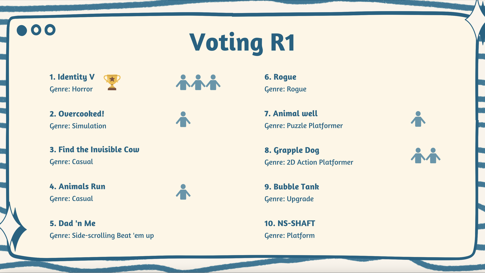
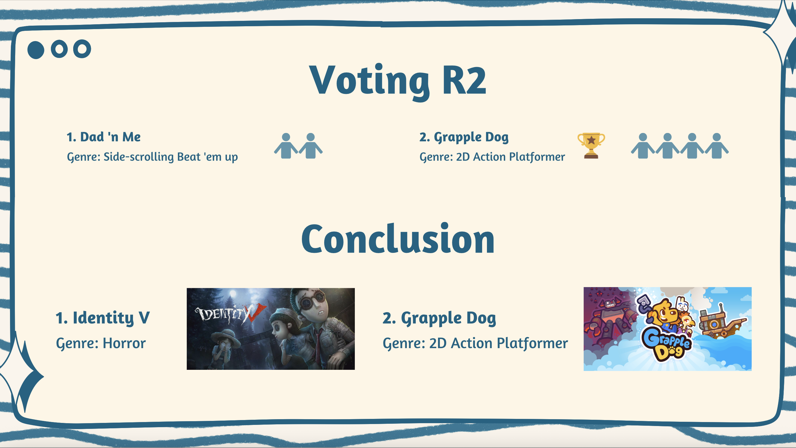

# 2026-group-12
2026 COMSM0166 group 12

# COMSM0166 Project Template
A project template for the Software Engineering Discipline and Practice module (COMSM0166).

## Info

This is the template for your group project repo/report. We'll be setting up your repo and assigning you to it after the group forming activity. You can delete this info section, but please keep the rest of the repo structure intact.

You will be developing your game using [P5.js](https://p5js.org) a javascript library that provides you will all the tools you need to make your game. However, we won't be teaching you javascript, this is a chance for you and your team to learn a (friendly) new language and framework quickly, something you will almost certainly have to do with your summer project and in future. There is a lot of documentation online, you can start with:

- [P5.js tutorials](https://p5js.org/tutorials/) 
- [Coding Train P5.js](https://thecodingtrain.com/tracks/code-programming-with-p5-js) course - go here for enthusiastic video tutorials from Dan Shiffman (recommended!)

## Your Game (change to title of your game)

STRAPLINE. Add an exciting one sentence description of your game here.

IMAGE. Add an image of your game here, keep this updated with a snapshot of your latest development.

LINK. Add a link here to your deployed game, you can also make the image above link to your game if you wish. Your game lives in the [/docs](/docs) folder, and is published using Github pages. 

VIDEO. Include a demo video of your game here (you don't have to wait until the end, you can insert a work in progress video)

## Your Group

- Group member 1, Ming Wei, ri25947@bristol.ac.uk, wming18082721229 - design
- Group member 2, Ming-Yen Tsai, az25406@bristol.ac.uk, marty12211
- Group member 3, Jay-Sin Chiu, ob25847@bristol.ac.uk, jess1115
- Group member 4, Yu-Cheng Cheng, ej25196@bristol.ac.uk, chuckyu1012
- Group member 5, Hsun-Han Huang, sf25156@bristol.ac.uk, bill1122y
- Group member 6, name, email, role

## Project Report

(Post by Kelly)

Game 1: Find the Invisible Cow

Description: A minimalist, audio-based hide-and-seek game. The player moves the cursor across a blank screen to find a hidden animal. The closer the cursor is to the target, the louder and faster the "Cow" sound becomes.

Key Mechanics:
- Proximity-based Audio: Audio volume and frequency scale dynamically based on the Euclidean distance between the cursor and the target.
- Audio-Visual Reveal: The hidden object is only revealed upon a successful click within the target radius.

Why it’s a great inspiration:
- Low Barrier to Entry: The game requires no keyboard inputs or complex controls, making it accessible to everyone.
- High Immersion: By replacing visual cues with auditory feedback, it creates a unique "hot or cold" exploration experience.
- Development Efficiency: The core logic focuses on coordinate math and audio manipulation rather than complex physics or high-end assets.

Game 2: Desktop Destroyer (Web Version Concept)

Description: A stress-relief game where players can use various tools (hammer, machine gun, chainsaw, etc.) to destroy their screen or a specific background image.

Key Mechanics:
- Dynamic Layering: Real-time rendering of "damage" sprites (cracks, bullet holes) over a background image.
- Tool Switching (Modular System): Different tools trigger unique visual effects and sound profiles.

Why it’s a great inspiration:
- Instant Gratification: Every click provides immediate visual and haptic feedback, making it highly satisfying for the user.
- Extensibility: We can easily swap backgrounds (e.g., a "Stressful Office" or "Final Exam" background) to create different themes without changing the core engine.
- Technical Value: It demonstrates our ability to handle Mouse Events, Layered Rendering (Canvas), and State Management (keeping track of all damage locations).

(Post by Kelly)

### Introduction

- 5% ~250 words 
- Describe your game, what is based on, what makes it novel? (what's the "twist"?) 

### Requirements 

- 15% ~750 words
- Early stages design. Ideation process. How did you decide as a team what to develop? Use case diagrams, user stories.

1. Ideation process
At the beginning, our team compiled the game references each of us was interested in into a [presentation](https://www.canva.com/design/DAHAFBXVeBs/qvce7yU9iheiYdaTl-wrqg/view?utm_content=DAHAFBXVeBs&utm_campaign=designshare&utm_medium=link2&utm_source=uniquelinks&utlId=hc3e06d4f69). During the meeting, we shared and discussed the genre, mechanics, and ideas behind each game. In the end, we selected two games that we were most interested in developing: Identity V and Grapple Dog.

2. Paper Prototypes

To better understand the game mechanics in depth and to evaluate how well the two games align with our game philosophy, we created two paper prototypes during the third workshop.

First game - Survival Nightmare:

This game is a top-down 1v1 chase-and-escape game, similar to Brawl Stars, set in a dark horror-themed environment with eerie background music. One player takes the role of the Hunter (controlled either by a second player or AI), while the other plays the Survivor. The map is filled with walls and obstacles, and placing or removing an obstacle requires a one-second delay. Throughout the match, items spawn randomly: Survivors can pick up flashlights and use them for two seconds to stun the Hunter for five seconds if exposed, while Hunters can collect souls to gain a temporary movement speed boost. The Survivor wins by collecting three randomly spawned keys to unlock the exit door and escape, but loses immediately if caught by the Hunter.

https://github.com/user-attachments/assets/5ee5a315-3f47-4811-a6de-c31d1ba30ffb

Full video: https://youtu.be/oWBqbGIQUwQ

Second game - Grapple Dog:

Feedback from other classmates:
1. The interface of game is very clear and comprehensive.
2. It is suggested that the number of maps should be more than one. Additionally, adding different types of terrain is a good idea to increase variety.
3. The win conditions still can be further expanded.
4. The map could be extended, but the boundary still needs to be considered.
5. After a character wins, the monster can gain new skills (e.g., breaking through walls or an increasing movement speed.)
6. The tongue-flicking mechanic is an impressive idea, because it’s more special than typical 2D games which only can run and jump.

Conclusion:
We decided to choose Grapple Dog as the game we would ultimately develop. The reason was that although Identity V had interesting and diverse mechanics, it would likely be more difficult to develop. Grapple Dog, in comparison, was relatively simpler and offered more room for development.

### Design

- 15% ~750 words 
- System architecture. Class diagrams, behavioural diagrams. 

### Implementation

- 15% ~750 words

- Describe implementation of your game, in particular highlighting the TWO areas of *technical challenge* in developing your game. 

### Evaluation

- 15% ~750 words

- One qualitative evaluation (of your choice) 

- One quantitative evaluation (of your choice) 

- Description of how code was tested. 

### Process 

- 15% ~750 words

- Teamwork. How did you work together, what tools and methods did you use? Did you define team roles? Reflection on how you worked together. Be honest, we want to hear about what didn't work as well as what did work, and importantly how your team adapted throughout the project.

### Conclusion

- 10% ~500 words

- Reflect on the project as a whole. Lessons learnt. Reflect on challenges. Future work, describe both immediate next steps for your current game and also what you would potentially do if you had chance to develop a sequel.

### Contribution Statement

- Provide a table of everyone's contribution, which *may* be used to weight individual grades. We expect that the contribution will be split evenly across team-members in most cases. Please let us know as soon as possible if there are any issues with teamwork as soon as they are apparent and we will do our best to help your team work harmoniously together.

### Additional Marks

You can delete this section in your own repo, it's just here for information. in addition to the marks above, we will be marking you on the following two points:

- **Quality** of report writing, presentation, use of figures and visual material (5% of report grade) 
  - Please write in a clear concise manner suitable for an interested layperson. Write as if this repo was publicly available.
- **Documentation** of code (5% of report grade)
  - Organise your code so that it could easily be picked up by another team in the future and developed further.
  - Is your repo clearly organised? Is code well commented throughout?
