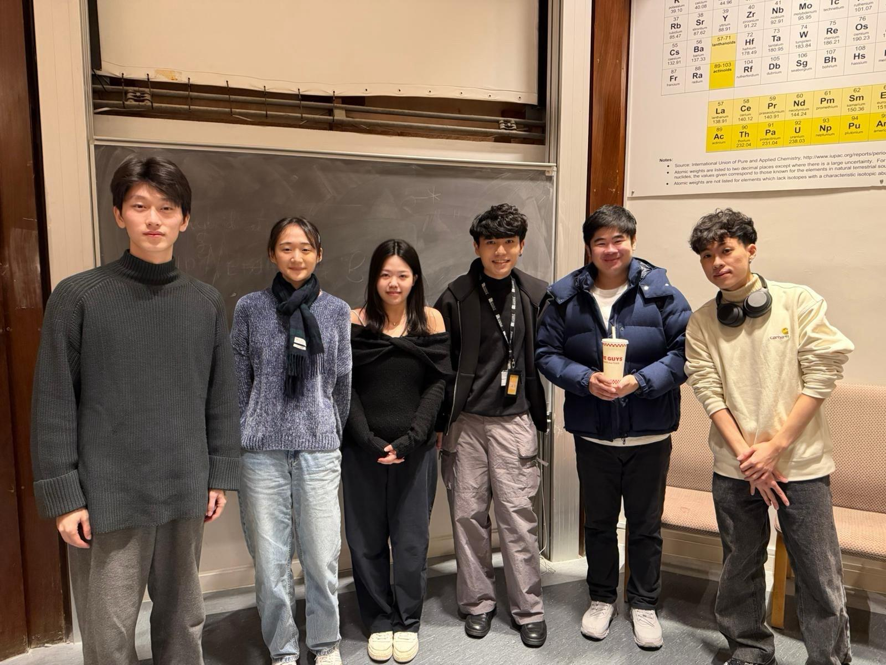

# 2026-group-12
2026 COMSM0166 group 12

# COMSM0166 Project Template
A project template for the Software Engineering Discipline and Practice module (COMSM0166).

## Info

This is the template for your group project repo/report. We'll be setting up your repo and assigning you to it after the group forming activity. You can delete this info section, but please keep the rest of the repo structure intact.

You will be developing your game using [P5.js](https://p5js.org) a javascript library that provides you will all the tools you need to make your game. However, we won't be teaching you javascript, this is a chance for you and your team to learn a (friendly) new language and framework quickly, something you will almost certainly have to do with your summer project and in future. There is a lot of documentation online, you can start with:

- [P5.js tutorials](https://p5js.org/tutorials/) 
- [Coding Train P5.js](https://thecodingtrain.com/tracks/code-programming-with-p5-js) course - go here for enthusiastic video tutorials from Dan Shiffman (recommended!)

## Your Game (change to title of your game)

STRAPLINE. Add an exciting one sentence description of your game here.

IMAGE. Add an image of your game here, keep this updated with a snapshot of your latest development.

LINK. Add a link here to your deployed game, you can also make the image above link to your game if you wish. Your game lives in the [/docs](/docs) folder, and is published using Github pages. 

VIDEO. Include a demo video of your game here (you don't have to wait until the end, you can insert a work in progress video)

## Your Group

- Group member 1, Ming Wei, ri25947@bristol.ac.uk, wming18082721229-design
- Group member 2, Ming-Yen Tsai, az25406@bristol.ac.uk, marty12211
- Group member 3, Jay-Sin Chiu, ob25847@bristol.ac.uk, jess1115
- Group member 4, Yu-Cheng Cheng, ej25196@bristol.ac.uk, chuckyu1012
- Group member 5, name, email, role
- Group member 6, name, email, role

## Project Report
（Post by Marty)

Game 1: Little Nightmares II
Genre: horror 
Game mechanics:
- Enemies stop moving when exposed to the player's flashlight.
- Players must keep the light focused on enemies while navigating the environment.

Game 2: Identity V
Genre: horror
Game mechanics:
- One player takes the role of the Hunter, while four players act as Survivors with different abilities.
- Survivors must decode cipher machines while avoiding or escaping the Hunter.
- Each character has unique skills that affect movement, detection, or chase outcomes.
- Survivors can place obstacles to slow down or block the Hunter, creating strategic opportunities to escape.

Game 3: Brawl Stars
Genre: Top-down shooter 
Game mechanics:
- Real-time top-down combat with simple controls.
- Each character has unique attacks and abilities.

Game inspiration from three of these games:

Map layout:
- The game uses a top-down perspective, similar to Brawl Stars.
- There are two roles: one Hunter and one Survivor.（The Hunter can be controlled by a second player or by AI.）
- The map contains many walls and obstacles.（Placing or removing an obstacle requires a 1-second delay.）
- The environment features a dark visual style with horror-themed background music.

Game mechanics:
- Flashlights spawn randomly on the map.
- When a Survivor picks up a flashlight, it can be used for 2 seconds. If the Hunter is exposed to the flashlight, the Hunter will be stunned for 5 seconds.
- Souls spawn randomly on the map. When picked up by the Hunter, they increase movement speed temporarily.

Game rule:
- Keys spawn randomly on the map. The Survivor must collect three keys to open the exit door and win the game.
- If the Survivor is caught by the Hunter, the Survivor loses immediately.

(Post by Marty)

(Post by Jess)

Type 1: Restaurant Management
- Reference Games: Cafeteria Nipponica, Overcooked!, PlateUp!
- Mechanics: Core management loop, resource allocation, and time management.
- Pros: The core mechanics are intuitive and easy to implement; highly extensible for adding new content (e.g., recipes or upgrades).
- Cons: Requires precise control over gameplay pacing; handling complex object interactions can be tedious.

Type 2: Card Games
- Reference Games: Hearthstone, Balatro
- Mechanics: Randomness, strategic decision-making, resource management, and rule-based logic.
- Pros: Focuses on system architecture and data-driven design; UI-centric development with minimal reliance on complex physics; highly scalable.
- Cons: High complexity in backend logic; difficult to achieve perfect numerical balance.

Type 3: Survival Games
- Reference Games: Don’t Starve
- Mechanics: Survival systems, gathering & crafting, environmental pressure, and spatial awareness.
- Pros: Demonstrates strong system integration skills; offers significant technical depth.
- Cons: High development challenge; managing complex UI.

(Post by Jess)

(Post by Kelly)

Game 1: Find the Invisible Cow

Description: A minimalist, audio-based hide-and-seek game. The player moves the cursor across a blank screen to find a hidden animal. The closer the cursor is to the target, the louder and faster the "Cow" sound becomes.

Key Mechanics:
- Proximity-based Audio: Audio volume and frequency scale dynamically based on the Euclidean distance between the cursor and the target.
- Audio-Visual Reveal: The hidden object is only revealed upon a successful click within the target radius.

Why it’s a great inspiration:
- Low Barrier to Entry: The game requires no keyboard inputs or complex controls, making it accessible to everyone.
- High Immersion: By replacing visual cues with auditory feedback, it creates a unique "hot or cold" exploration experience.
- Development Efficiency: The core logic focuses on coordinate math and audio manipulation rather than complex physics or high-end assets.

Game 2: Desktop Destroyer (Web Version Concept)

Description: A stress-relief game where players can use various tools (hammer, machine gun, chainsaw, etc.) to destroy their screen or a specific background image.

Key Mechanics:
- Dynamic Layering: Real-time rendering of "damage" sprites (cracks, bullet holes) over a background image.
- Tool Switching (Modular System): Different tools trigger unique visual effects and sound profiles.

Why it’s a great inspiration:
- Instant Gratification: Every click provides immediate visual and haptic feedback, making it highly satisfying for the user.
- Extensibility: We can easily swap backgrounds (e.g., a "Stressful Office" or "Final Exam" background) to create different themes without changing the core engine.
- Technical Value: It demonstrates our ability to handle Mouse Events, Layered Rendering (Canvas), and State Management (keeping track of all damage locations).

(Post by Kelly)

(Post by Chuck)

Game 1: Go Downstairs
•	Game Introduction: Control the character to move left or right to descend. The game features trampolines, spikes, and flipping stairs. This game supports two players to compete by pushing or blocking each other; the last one standing wins (or continues to break floor records).
•	TWIST Part: Add traps like timed-pause stone steps (where you must jump to move) or skills to attack opponents in the two-player mode (e.g., picking up or throwing the opponent) to increase game richness.
•	Design Pros:
1.	Simple character control with only left and right keys.
2.	Intuitive gameplay; the last survivor wins.
Game 2: Animals Run
•	Game Introduction: Inspired by people checking out in social media reels; players choose different animals to dash to the finish line. The loser pays the bill. Every animal should have the same winning probability; it's all about picking which animal wins.
•	TWIST Part:
1.	Design various racing scenes like Sky (climbing ropes for non-flying animals), Land, Ocean, etc., which appear randomly. (e.g., a dog's speed is multiplied by 1 on land, 0.6 on sky ropes, and 0.75 in the ocean. If every animal's base speed is the same, the random selection won't be affected, but variables in different scenes can add variety and fun. For instance, a seahorse might lose on land but beat a rhino in the ocean).
2.	Or a "Fast & Furious" style nitro setting: each player has one 5-second speed boost per game.
•	Design Pros:
1.	Simple gameplay: pick an animal and you are set. At most, add one button requirement for the "TWIST" feature.
2.	Simple logic: rank determines the winner.
3.	Multiplayer support (up to 4 players).
4.	Offers more character choices than the original game.
5.	Simple game logic.

(Post by Chuck)

### Introduction

- 5% ~250 words 
- Describe your game, what is based on, what makes it novel? (what's the "twist"?) 

### Requirements 

- 15% ~750 words
- Early stages design. Ideation process. How did you decide as a team what to develop? Use case diagrams, user stories. 

### Design

- 15% ~750 words 
- System architecture. Class diagrams, behavioural diagrams. 

### Implementation

- 15% ~750 words

- Describe implementation of your game, in particular highlighting the TWO areas of *technical challenge* in developing your game. 

### Evaluation

- 15% ~750 words

- One qualitative evaluation (of your choice) 

- One quantitative evaluation (of your choice) 

- Description of how code was tested. 

### Process 

- 15% ~750 words

- Teamwork. How did you work together, what tools and methods did you use? Did you define team roles? Reflection on how you worked together. Be honest, we want to hear about what didn't work as well as what did work, and importantly how your team adapted throughout the project.

### Conclusion

- 10% ~500 words

- Reflect on the project as a whole. Lessons learnt. Reflect on challenges. Future work, describe both immediate next steps for your current game and also what you would potentially do if you had chance to develop a sequel.

### Contribution Statement

- Provide a table of everyone's contribution, which *may* be used to weight individual grades. We expect that the contribution will be split evenly across team-members in most cases. Please let us know as soon as possible if there are any issues with teamwork as soon as they are apparent and we will do our best to help your team work harmoniously together.

### Additional Marks

You can delete this section in your own repo, it's just here for information. in addition to the marks above, we will be marking you on the following two points:

- **Quality** of report writing, presentation, use of figures and visual material (5% of report grade) 
  - Please write in a clear concise manner suitable for an interested layperson. Write as if this repo was publicly available.
- **Documentation** of code (5% of report grade)
  - Organise your code so that it could easily be picked up by another team in the future and developed further.
  - Is your repo clearly organised? Is code well commented throughout?
