# 2026-group-12
2026 COMSM0166 group 12

## SKAARL

STRAPLINE. Add an exciting one sentence description of your game here.

IMAGE. Add an image of your game here, keep this updated with a snapshot of your latest development.

LINK. Add a link here to your deployed game, you can also make the image above link to your game if you wish. Your game lives in the [/docs](/docs) folder, and is published using Github pages. 

VIDEO. Include a demo video of your game here (you don't have to wait until the end, you can insert a work in progress video)

## Your Group

  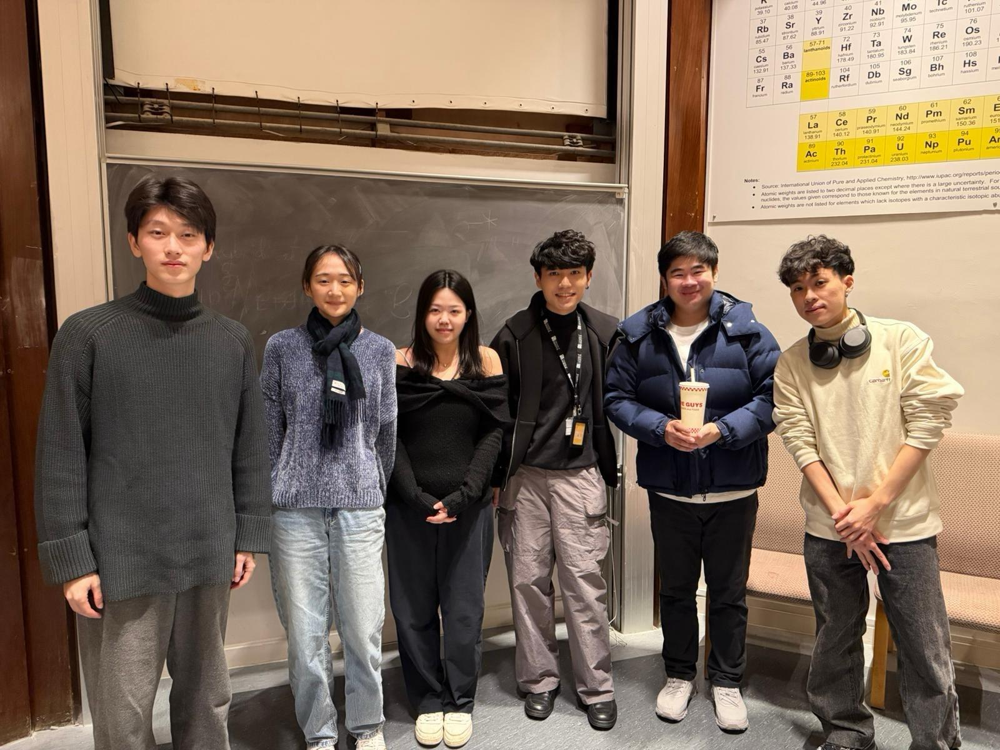

<table align="center">
  <tr>
    <th>Member</th>
    <th>Email</th>
    <th>Github</th>
    <th>Role</th>
  </tr>
  <tr>
    <td>Ming Wei</td>
    <td>ri25947@bristol.ac.uk</td>
    <td>wming18082721229</td>
    <td>Project Manager / Frontend Engineer / Developer</td>
  </tr>
  <tr>
    <td>Jay-Sin Chiu</td>
    <td>ob25847@bristol.ac.uk</td>
    <td>jess1115</td>
    <td>Project Manager / Frontend Engineer / Developer</td>
  </tr>
  <tr>
    <td>Yi-Hsin Peng</td>
    <td>dq25826@bristol.ac.uk</td>
    <td>pphsin</td>
    <td>Game Systems Architect / Developer</td>
  </tr>
  <tr>
    <td>Hsun-Han Huang</td>
    <td>sf25156@bristol.ac.uk</td>
    <td>bill1122y</td>
    <td>Game Systems Architect / Developer</td>
  </tr>
  <tr>
    <td>Yu-Cheng Cheng</td>
    <td>ej25196@bristol.ac.uk</td>
    <td>chuckyu1012</td>
    <td>Game Systems Architect / Developer</td>
  </tr>
  <tr>
    <td>Ming-Yen Tsai</td>
    <td>az25406@bristol.ac.uk</td>
    <td>marty12211</td>
    <td>QA & Optimization Engineer / Developer</td>
  </tr>
</table>

## Table of Contents
* [Ideation Process](#ideation-process--ideation-process)
* [Paper Prototypes](#paper-prototypes)
    * [First Game – Survival Nightmare](#first-game--survival-nightmare)
    * [Second Game – Skaarl](#second-game--skaarl)

---

## Project Report

## Introduction

Our game, "Skaarl," was inspired by ["Grapple Dog"](https://theboar.org/2023/03/grapple-dog-a-platformer-that-comes-out-swinging/). It is a 2D side-scrolling platformer co-conceived by our team that cleverly transforms the core grappling hook mechanic into a lizard's tongue-swinging gameplay.

The story is set during the Easter holidays. It begins when a mischievous rabbit sneaks into Mother Lizard's home while she is out hunting, stealing three lizard eggs to paint as Easter eggs. Upon returning home, Mother Lizard finds her eggs missing, with only a carrot left behind by the rabbit. Determined to recover her babies, she embarks on a challenging adventure.

The game consists of one tutorial level to teach all the functions and three levels with increasing difficulty. Our team collaboratively designed the unique mechanical twists, such as the tongue-swinging and egg-collection victory mechanisms. Players control Mother Lizard, using her tongue to swing and agilely navigate through complex terrains. In addition to testing players' "parkour" skills, they can switch between limited-time "Fire" and "Ice" power-ups to damage and slow down the ant and bee minions along the way. Players must collect keys to clear the first two levels by taking down the ant and bee enemies. In the last stage, they confront the final boss: a rabbit who relentlessly throws carrot bombs to stop Mother Lizard. After a fierce fight, successfully reclaiming the three eggs and passing through the final exit secures the ultimate victory! 

## Requirements 

### Ideation process & Ideation process

At the beginning, our team initiated the design process by compiling a list of game references that each of the six team members was personally interested in. In total, we brought together 10 different games for consideration. presentation. During our initial meeting, we presented our selected games to the group, sharing not only the genre and mechanics of each game, but also the core ideas and unique aspects that made these games appealing to us. Through this collaborative discussion, we were able to explore different perspectives, identify common interests, and evaluate which game concepts might be the most feasible and engaging for development. To narrow down our options, we conducted two rounds of voting. In the first round, each member voted for their top three preferred games, which resulted in Identity V receiving the most votes and becoming the clear front-runner. In the second round, we focused on the remaining games and discussed their potential in terms of gameplay, creativity, and alignment with our team’s skills. After careful consideration, Grapple Dog emerged as the second top choice, complementing Identity V’s style and mechanics. By the end of this process, we reached a consensus and selected these two games as the projects we were most excited to develop. This method ensured that every team member’s preferences were considered and that our final decision was both democratic and well-informed.

  <strong>Figure 1 - First Voting Result</strong> 
  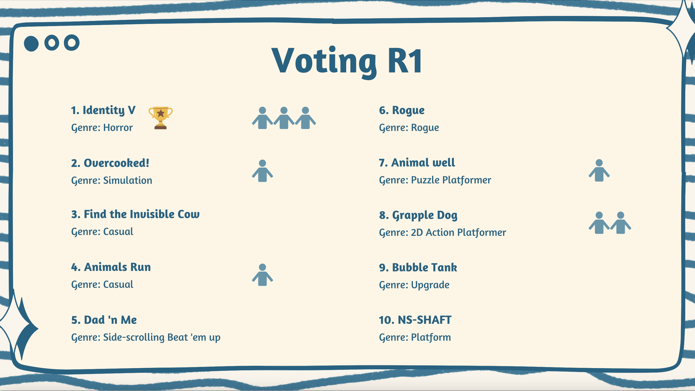

 

  <strong>Figure 2 - Second Voting Result</strong> 
  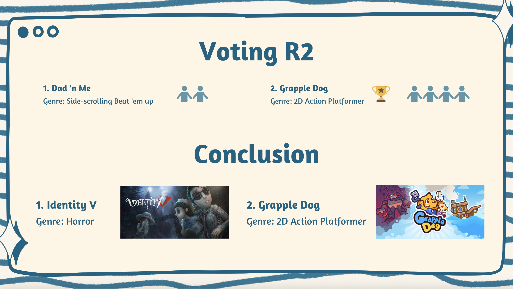

---

### Paper Prototypes

To better understand the mechanics of each concept and evaluate how well they aligned with our design goals, we created two paper prototypes during the third workshop.

#### First Game – Survival Nightmare

A top‑down 1v1 chase‑and‑escape game set in a dark, horror‑themed environment. One player controls the Hunter (or an AI), while the other plays the Survivor. The map contains walls and obstacles, and placing or removing an obstacle requires a one‑second delay. Items spawn randomly: Survivors can pick up flashlights to stun the Hunter for five seconds, while Hunters can collect souls for temporary speed boosts. The Survivor wins by collecting three keys to unlock the exit door but loses instantly if caught.

**Figure 3 - Demonstration of Survival Nightmare:**  

https://github.com/user-attachments/assets/5ee5a315-3f47-4811-a6de-c31d1ba30ffb  

Full video: https://youtu.be/oWBqbGIQUwQ

---

#### Second Game – Skaarl 
A fast‑paced 2D platformer built around momentum.  
Players use a lizard’s sticky tongue to grab walls, ceilings, or objects and swing across the environment. Natural membranes allow gliding, and movement can be chained smoothly to discover multiple routes, avoid enemies, and maintain speed through fluid traversal.

**Figure 4 - Demonstration of Skaarl: (Click the image below to watch the full video.)** 

  

---

#### Feedback

1. The interface is clear and easy to understand.  
2. More maps and varied terrain would improve gameplay variety.  
3. Win conditions could be expanded further.  
4. The map could be larger, but boundaries must be considered.  
5. After a character wins, the monster could gain new abilities (e.g., breaking walls, increased speed).  
6. The tongue‑flicking mechanic stands out as a unique idea compared to typical 2D platformers.

#### Conclusion

We ultimately chose the second game for development. While the first game offered interesting mechanics, it would have been more complex to build. The second game was more manageable and provided more room for creative expansion.

---

### Twist ideas from members

1. **Core Transformation and Ability System**  
Create a diverse action system by combining the "consuming insects or elements" mechanic with "item-based transformations."

> - Transformation Mechanism: Inspired by Kirby or Super Mario Odyssey, the protagonist can switch between different lizard forms by consuming specific insects or using special items.  
>
> - Form Functionalities:  
>   Draco (Flying Lizard): Extends gliding distance, allowing the player to cross large terrain gaps.  
>   Chameleon: Blends into the environment to become invisible, useful for evading powerful enemies.  
>   Frilled-neck Lizard: Scares off predators or utilizes its frill for specialized gliding.  
>
> - Elemental Infusion: By using its tongue to consume fire or ice elements, the lizard can imbue its standard attacks with additional elemental damage.  
>
> - Biological Survival and Escape Skills  
>   Enhance combat depth by utilizing the unique physiological traits of real-world lizards.  
>   Autotomy (Tail Shedding): An active skill that can be triggered when health is critically low. The shed tail remains on the ground to distract monsters, granting the player a brief window of invincibility and a speed boost to escape.  
>
> - Resource Cost: This skill consumes a portion of energy, and there is a cooldown period while the tail regenerates before it can be used again.

2. **Environmental Interaction and Secret Paths**  
Emphasize the lizard's agility and map exploration.  
Multi-dimensional Exploration: Level design includes not only flat ground but also vertical wall-climbing and underground digging.  
Hidden Passageways: Secret paths—such as underground burrows or shortcuts inside tree trunks—that can only be discovered or accessed by specific forms (e.g., the Chameleon or a miniature lizard form).

3. **Narrative Goals and Arch-Nemesis**  
Establish concrete motivation and a final challenge for the player.  
Story Background: Define the lizard's motivation for the journey (e.g., protecting the forest or rescuing companions).  
Nemesis Design: Introduce the lizard's natural predator—the Snake—as the final boss. The final battle will require the player to master all previously learned transformation and camouflage skills to defeat this powerful predator.

#### Final Gameplay Twist & Mechanics
To add a unique layer of strategy and some surprising features, the final game design incorporates the following mechanics:

* **Dynamic Traversal & Elemental Attacks:** The lizard’s primary movement is built around a **tongue-swinging** mechanic, allowing players to grapple and swing through complex terrain. For combat, players can catch **Fire Butterflies** or **Ice Butterflies** with their tongue to instantly gain flame-throwing or freezing abilities to take down foes.

* **Objective-Based Progression:** Clearing a stage isn't just about reaching the end. Players must hunt down enemies to collect **three hidden keys**. These keys are essential to unlocking the Great Gate that leads to the next environment.

* **The "Easter Surprise" Final Encounter:** In a major twist, the ultimate threat is revealed to be the **Easter Bunny**. Unlike previous stages, victory isn't achieved through pure combat alone; players must navigate the boss arena to track down and collect **three mysterious Eggs** to finally clear the game.

---

### Stakeholders

  <strong>Figure 5 - Onion Model</strong> 
   
  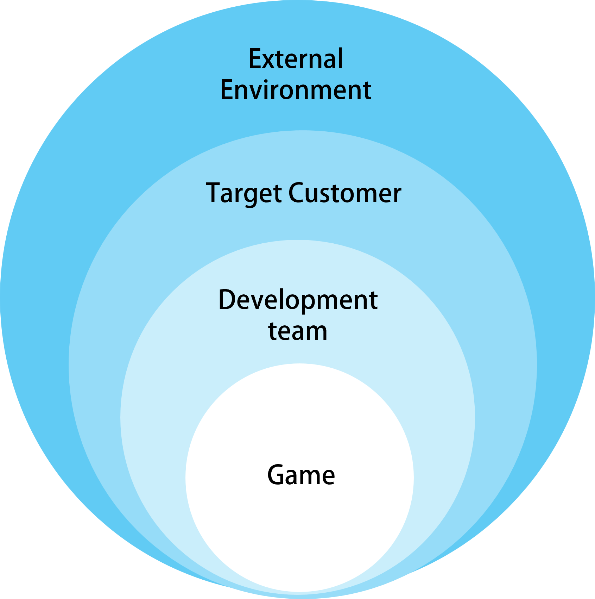

Drawing an Onion Diagram helps us clarify our stakeholders. We have separated them into three groups based on the degree and direction of their impact.
The First Tier is the development team, including all members of group 12. During the development process, all members' schedules in TB2 will be significantly affected; however, the project provides us with invaluable experience in game development and teamwork.
The Second Tier consists of the target customers; this means our game is developed specifically to meet their needs. These stacker holders include teacher, TA, testers and players. Of course they will get gameplay experience, and the feedback provided by them will help us improve our game.
The Third Tier is the external environment, including anyone indirectly affected by the game, such as competitors in the same domain, other developers searching for inspiration, or viewers watching gameplay streams. Although they may not experience this game in person, they will still be affected by the game's content to varying degrees.

---

### Epics and User Stories
<h4>User Stories for Lizard Adventure</h4>

<table>
  <tr>
    <th>Stakeholder</th>
    <th>Epic</th>
    <th>User Story</th>
  </tr>

  <tr>
    <td>Player</td>
    <td>Collision System</td>
    <td>As a player, I want collisions to be handled consistently, so that interactions between me, enemies, and objects work correctly.</td>
  </tr>

  <tr>
    <td>Player</td>
    <td>Data Security</td>
    <td>As a player, I want my personal information protected and my game data securely backed up.</td>
  </tr>

  <tr>
    <td>Developer</td>
    <td>Data Analysis</td>
    <td>As a developer, I want the game data properly stored and structured for easy analysis.</td>
  </tr>

  <tr>
    <td>Player</td>
    <td>Reward System</td>
    <td>As a player, I want to earn skills after completing levels, so I have motivation to keep improving.</td>
  </tr>

  <tr>
    <td>Player</td>
    <td>Engagement</td>
    <td>As a player, I want rewards that encourage me to keep playing and share the game with others.</td>
  </tr>

  <tr>
    <td>Player</td>
    <td>Tutorial Clarity</td>
    <td>As a player, I want tutorials that explain game mechanics quickly.</td>
  </tr>

  <tr>
    <td>Player</td>
    <td>Smooth Gameplay</td>
    <td>As a player, I want fluent, responsive gameplay.</td>
  </tr>

  <tr>
    <td>Player</td>
    <td>Combat Diversity</td>
    <td>As a player, I want diverse combat modes against bosses and monsters, including tongue strikes and environmental triggers.</td>
  </tr>

  <tr>
    <td>Player</td>
    <td>Dynamic Level Environments</td>
    <td>As a player, I want levels with environmental effects (arctic zones with health drain, tropical zones with rapid enemy spawns).</td>
  </tr>

  <tr>
    <td>Player</td>
    <td>Tongue Mechanics</td>
    <td>As a player, I want to use the lizard’s tongue to latch and swing across gaps, maintaining momentum.</td>
  </tr>

  <tr>
    <td>Player</td>
    <td>Gliding Mechanic</td>
    <td>As a player, I want to glide while airborne to extend jumps, adjust landing, and chain movements.</td>
  </tr>
</table>

--- 

### Use Case Specifications 

  <strong>Figure 6 - Use Case Diagram</strong> 
  

<table>
  <tr>
    <th>Use Case ID</th>
    <th>Use Case Name</th>
    <th>Primary Actor</th>
    <th>Description</th>
    <th>Preconditions</th>
    <th>Trigger</th>
    <th>Main Flow (Summary)</th>
    <th>Postconditions</th>
    <th>Alternatives / Exceptions</th>
  </tr>

  <tr>
    <td>UC1</td>
    <td>Start Game</td>
    <td>Player</td>
    <td>Start a new gameplay run</td>
    <td>Game launched; main menu visible</td>
    <td>Player selects Start Game</td>
    <td>System initializes run and enters gameplay loop</td>
    <td>New run active</td>
    <td>Loading failure returns to menu</td>
  </tr>

  <tr>
    <td>UC2</td>
    <td>Configure Settings</td>
    <td>Player</td>
    <td>Adjust game preferences</td>
    <td>Player in menu</td>
    <td>Player opens settings</td>
    <td>System displays and saves updated preferences</td>
    <td>Settings updated</td>
    <td>Invalid input rejected</td>
  </tr>

  <tr>
    <td>UC3</td>
    <td>Play Game</td>
    <td>Player</td>
    <td>Progress through levels</td>
    <td>Run has started</td>
    <td>Gameplay begins</td>
    <td>Move → Jump → Grapple → Shoot → Collect → Avoid enemies → Repeat</td>
    <td>Player progresses or run ends</td>
    <td>Pause, Quit, or Game Over</td>
  </tr>

  <tr>
    <td>UC4</td>
    <td>Tongue Swing (Grapple)</td>
    <td>Player</td>
    <td>Swing tongue to reach platforms or enemies</td>
    <td>Play Game active</td>
    <td>Player uses grapple</td>
    <td>Player attaches tongue → Swing → Release → Land</td>
    <td>Player moved to target or enemy hit</td>
    <td>Tongue misses → fall or reset</td>
  </tr>

  <tr>
    <td>UC5</td>
    <td>Shoot Fire/Ice Ball</td>
    <td>Player</td>
    <td>Attack enemies using elemental powers</td>
    <td>Play Game active</td>
    <td>Player presses attack</td>
    <td>Fire/Ice ball created → Travel → Hit enemy → Damage applied</td>
    <td>Enemy damaged or defeated</td>
    <td>Attack misses → ball disappears</td>
  </tr>

  <tr>
    <td>UC6</td>
    <td>Collect Butterfly Items</td>
    <td>Player</td>
    <td>Gain elemental transformations</td>
    <td>Item available</td>
    <td>Player touches item</td>
    <td>Player picks up butterfly → Transformation applied</td>
    <td>Player transformed</td>
    <td>Inventory full or item inaccessible</td>
  </tr>

  <tr>
    <td>UC7</td>
    <td>Collect Keys</td>
    <td>Player</td>
    <td>Pick up keys to unlock doors</td>
    <td>Key available in level</td>
    <td>Player touches key</td>
    <td>Player picks up key → Inventory updated</td>
    <td>Key added to inventory</td>
    <td>None</td>
  </tr>

  <tr>
    <td>UC8</td>
    <td>Grab Egg</td>
    <td>Player</td>
    <td>Collect eggs for level progression</td>
    <td>Egg available in level</td>
    <td>Player touches egg</td>
    <td>Player grabs egg → Inventory updated</td>
    <td>Egg collected</td>
    <td>None</td>
  </tr>

  <tr>
    <td>UC9</td>
    <td>Open Door</td>
    <td>Player</td>
    <td>Unlock doors using keys</td>
    <td>Player has key</td>
    <td>Player reaches door</td>
    <td>Player unlocks door → Level transition triggered</td>
    <td>Door open → Next level accessible</td>
    <td>Missing key prevents unlocking</td>
  </tr>

  <tr>
    <td>UC10</td>
    <td>Avoid/Defeat Enemies</td>
    <td>Player</td>
    <td>Survive or defeat enemies like ants, bees, rabbits</td>
    <td>Enemies present</td>
    <td>Enemies appear</td>
    <td>Player attacks or dodges enemies → Clear area</td>
    <td>Area cleared</td>
    <td>Player damaged or killed</td>
  </tr>

  <tr>
    <td>UC11</td>
    <td>Reach Level Goal</td>
    <td>Player</td>
    <td>Reach the end point of the level</td>
    <td>Run has started</td>
    <td>Player moves to goal</td>
    <td>Player reaches goal coordinates → Level completed</td>
    <td>Level completed</td>
    <td>Player dies before reaching goal</td>
  </tr>
</table>

---

## Design

### System Architecture

  <h3>1. Overview</h3>
  

This project implements a 2D tile-based platformer using a modular architecture built on top of p5.js. The system follows a hybrid design combining entity-based modeling, a centralized physics system, and manager-driven resource control. The core principle is to separate behavior (Player FSM), physics (movement and collision), and world data (tile map) to ensure maintainability and extensibility.
  

  <h3>2. Core Components</h3>
  <h4>2.1 Entity Hierarchy</h4>
  

The base abstraction is defined in Entity.js, which provides fundamental properties such as position and size, also abstract methods update() and display(). Figure.js extends Entity by introducing velocity and collision state, making it the primary unit affected by physics.
All dynamic game objects (e.g., Player, Enemy) inherit from Figure. This ensures that movement and collision handling remain consistent across all physical entities.
  

  <h4>2.2 Physics System</h4>
  

The Physics.js module is responsible for updating position and resolving collisions. It operates directly on Figure instances and uses data from MapManager for collision detection.
Key characteristics:
  

    <ul>
      <li>Velocity-based movement (pos += vel)</li>
      <li>Axis-separated movement and collision resolution (X and Y handled independently)</li>
      <li>Tile-based collision using map queries</li>
    </ul>
  
This design ensures deterministic and stable platformer physics while preventing issues such as tunneling or inconsistent collision states.

  <h4>2.3 Player and State Machine</h4>
  

    The Player class acts as a controller that integrates input handling, state management, and movement logic.
    It uses a finite state machine (FSM) implemented via updateState() and state-specific handlers. Each state (e.g., grounded, jumping, falling) determines how movement is applied. 
     
    
<strong>Figure 7 - State Diagram</strong>

    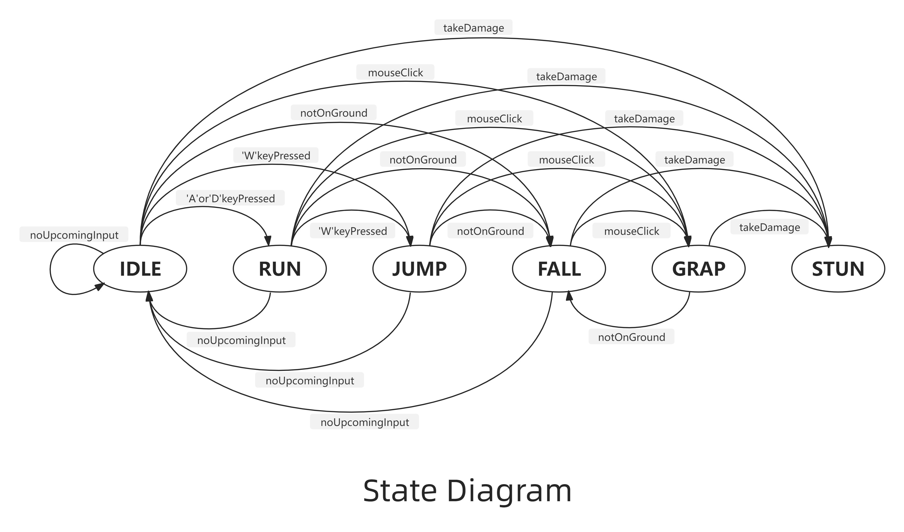
  

  
Movement is abstracted into reusable methods such as applyGroundMovement(), allowing consistent integration with physics.

  <h4>2.4 Grapple Ability</h4>
  
The grappling feature is implemented as a module GrappleAbility, it functionally operates as a player-bound ability. It is invoked directly by the Player and modifies the player’s velocity based on anchor points and rope constraints. It does not directly control position or collision.
    This design ensures that grappling integrates seamlessly with the existing physics system without violating separation of concerns.

  <h3>3. World and Data Management</h3>
  <h4>3.1 MapManager</h4>
  
 MapManager handles tile-based world representation using data exported from Tiled (JSON format). It provides:

  <ul>
    <li>Tile lookup (getTileAt)</li>
    <li>Collision queries (isSolid)</li>
    <li>Rendering of the tile map</li>
  </ul> 
  
The map is stored as a 1D array, and world coordinates are converted into tile indices for efficient lookup.

  <h4>3.2 Level and Resource Management</h4>
  <ul>
    <li>LevelManager handles loading and switching between levels</li>
    <li>SaveManager ensures that progress will not be lost when the page was refreshed</li>
    <li>UIManager is responsible for rendering all UI elements</li>
  </ul> 
  
Assets (maps, images) are organized separately under the assets directory. 

  <h3>4. Game Loop and Data Flow</h3>
  
The main loop (in sketch.js) orchestrates the update sequence:

  <ul>
    <li>Load data and initialize the game(user interface, player, enemies, collectibles)</li>
    <li>Input is processed by the Player</li>
    <li>Player updates its state via FSM</li>
    <li>Movement logic modifies velocity</li>
    <li>Grapple ability further adjusts and constrains velocity if active</li>
    <li>Physics system updates position and resolves collisions</li>
    <li>Rendering is performed (entities, map, UI)</li>
  </ul> 
  
This pipeline ensures a clear separation between decision-making, physical simulation, and rendering.

  <h3>5. Design Characteristics</h3>
  
The architecture emphasizes:

  <ul>
    <li>Separation of concerns (input, behavior, physics, world)</li>
    <li>Reusability through inheritance (Entity → Figure)</li>
    <li>Stability via centralized physics handling</li>
    <li>Extensibility for future systems (e.g., new abilities, AI, weapons)</li>
  </ul> 

  <strong>Figure 8 - Class Diagram</strong>
  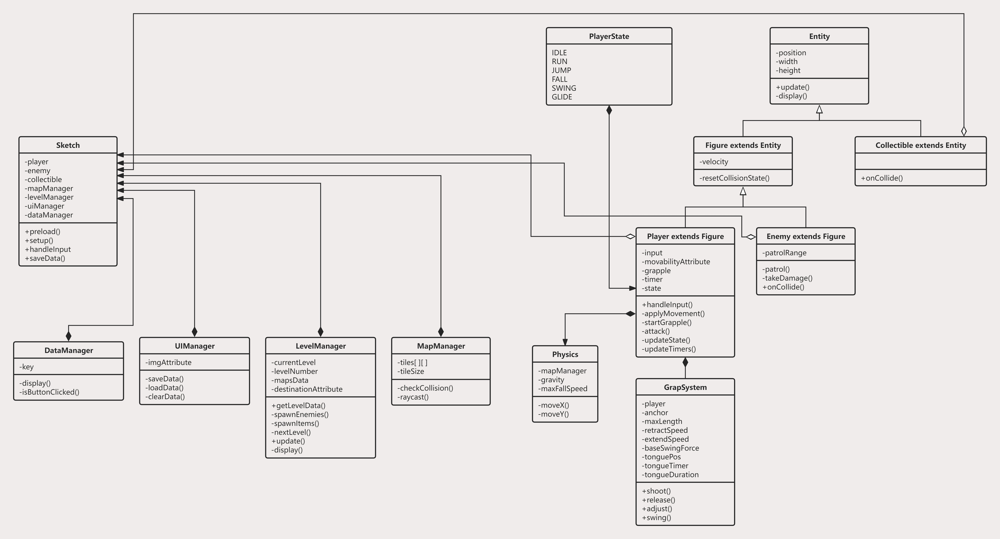

### Sequence diagram (behavioural diagram)

  <strong>Figure 9 - Sequence Diagram</strong>
  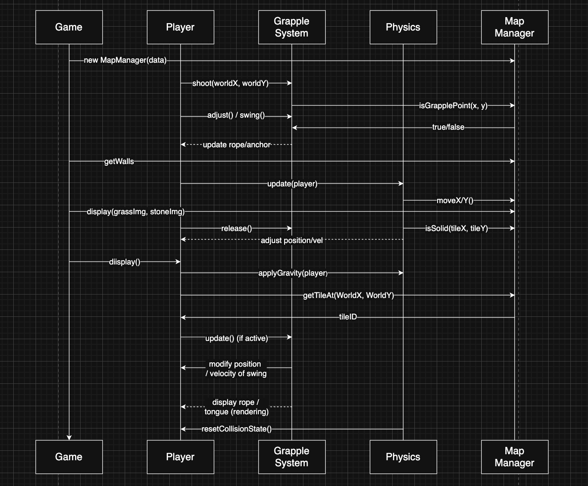

This diagram shows how the core parts of the game work together during a grapple: the player throws a hook toward a target, the system checks with the map to see if it’s a valid point, and if it is, the grapple system takes over to handle swinging while the physics engine updates movement, gravity, and collisions; once the player releases, their position and velocity are adjusted accordingly, and everything from the player to the rope to the environment is updated in a continuous loop.

The MapManager is basically what keeps track of the world. Whenever something moving, colliding, or trying to grapple. Everything just checks with it to see what’s actually there. It knows what’s solid, what isn’t, and what you can interact with, so instead of guessing, everything just follows what the MapManager says.

## Implementation

### Technical Challenge 1: Physics System & Grapple System

One of the primary technical challenges was building a stable physics engine and grapple system from scratch. Since the two systems are deeply interconnected, instability in the physics layer directly affected the feel and reliability of the grapple mechanic.

**Physics System**
- In the early prototype, movement and collision resolution were scattered across multiple modules, causing clipping and tunneling issues that were especially noticeable during high-speed swinging. A dedicated Physics class was introduced to centralise all position updates and collision resolution, ensuring consistent behaviour across all entities including the player and enemies.
- Movement is decomposed into separate X and Y axes, allowing each direction to be resolved independently. This prevents corner-catching and produces stable, predictable collision behaviour.
- A maximum fall speed was enforced to prevent high-velocity tunneling through thin floor tiles, a common issue in tile-based platformers.
- A finite state machine (FSM) was introduced to manage player behaviour, separating state transition logic from movement logic and making it easier to add new mechanics without breaking existing systems.

**Grapple System**
- To prevent the tongue from passing through walls, the shoot function uses step-based raycasting, scanning every 5 pixels along the trajectory until hitting a valid grapple tile or a solid surface, ensuring the tongue always stops at the correct position.
- Swing angle instability caused erratic movement and sudden reversals due to small positional differences relative to the anchor point. This was resolved by smoothing angle changes and temporarily disabling swing direction calculation when the player was too close to the anchor.
- Releasing the grapple caused the player to burst forward uncontrollably due to accumulated swing velocity. This was fixed by capping the maximum swing speed during grappling.
- The rope constraint is enforced through position correction combined with velocity projection, removing the radial component of velocity to produce natural pendulum motion rather than abrupt position snapping.
- The tongue animation flickered during movement because the origin point was not updating dynamically with the player's position. This was fixed by recalculating the tongue's starting point relative to the player's mouth on every frame.

### Technical Challenge 2: Boss Battle & Smart Boss

In developing the boss battle, our primary challenge was creating a boss that with intelligence—like artificial intelligence, which can take action base on "seeing the player" and "seeing the map" .

**Idea of boss AI**

Initially, we aimed to build a complex logical system to simulate artificial intelligence. However, considering the excessive complexity and computational loading, we adjusted our goal to "Demonstrating high intelligence within a constrained environment."

**Boss Battle Map**

To achieve this, we designed a closed cave with three platforms(two low platforms and one high platform). This allowed us to focus on boss’s intelligence in pathfinding and pursuit the player in two-dimensional space.

**State Machine & Core Logic**

The Boss inherits the enemy's damage and physical logic from Enemy class and using a player-like state machine. T Its core logic is driven by the behavior method, which uses a playerDetect function to change boss state based on the player's relative height.

**Equal-height logic:** When on the same height as the player, we make the boss continuously face the player. We implemented simple wall-collision handling, allowing the boss to reverse direction if it hits a dead end.

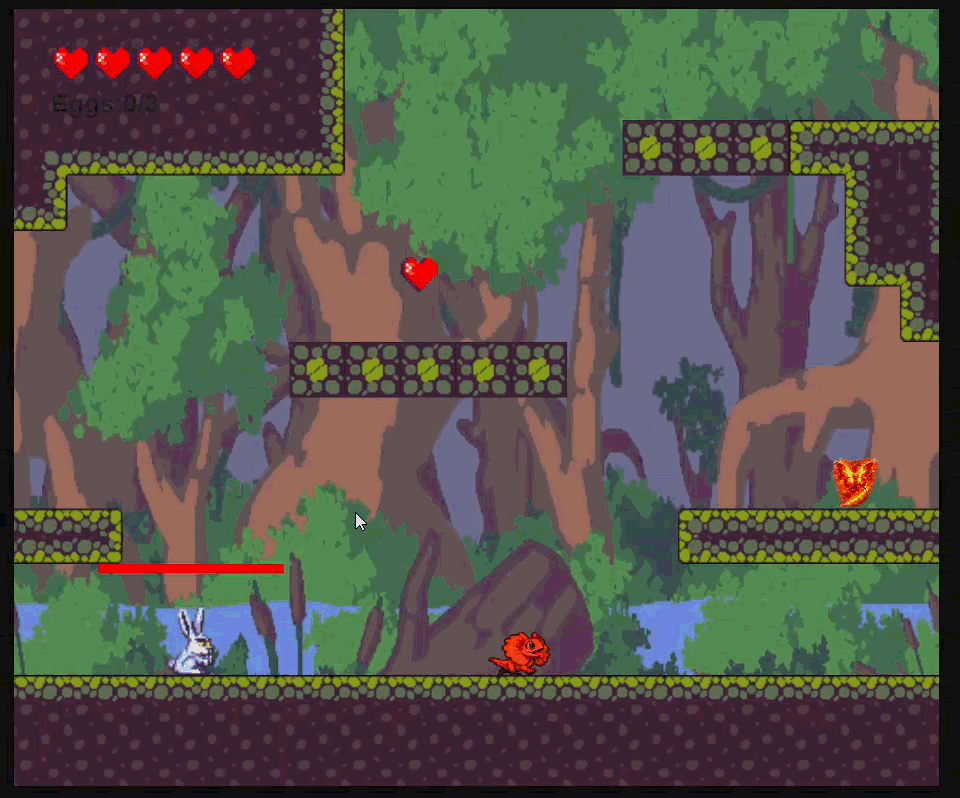

**Go down logic:** When the player is below, the boss can easily get trapped below the lower platform. It cannot find edge of platform to go down because of keep changing its direction, Therefore, we make the boss maintain its initial direction while descending the stairs unless it hits a wall.

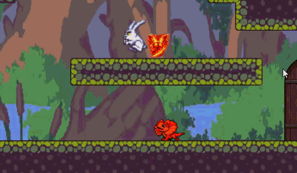

**Go up logic:** To prevent failed jumps, we gave boss "vision" though using the MapManager's isSolid function, allowing it to see the position of the square in front of it. This function allows the boss determine whether there are any floating blocks in front of it or behind.

**Tunnel Escape:** If the boss is below a lower platform, we want the boss to be able to successfully leave the platform first. Therefore, When the boss knows there's a block above its head, it will stick to its initial direction and to move horizontally until it leaves the platform.

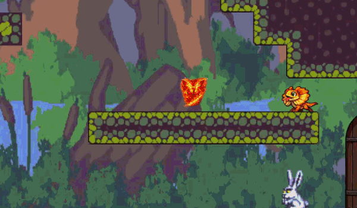

**Conclusion:**
 By combining all the logic rules, we successfully built an intelligent movement system, which is able to move logically and pursue the player within a limited map.

## Evaluation

### Qualitative Evaluation
During development, we designed an easy level with ants as enemies and a simpler terrain to clear the game, alongside a hard level featuring both ants and bees in the map, and the testing players needed to operate the tongue mechanic to finish the game. We invited more than ten players to playtest the game using the Think-Aloud protocol, allowing us to capture their real-time frustrations and suggestions regarding visuals, controls, and narrative.

While the majority found the interface clear and thought our animations vivid, our team conducted a subsequent Heuristic Evaluation based on their feedback to address key usability violations:

1. **Visibility of System Status**: To better communicate game mechanics, we added visual feedback, such as floating keys when collected from the enemies.
2. **User Control and Freedom**: Players expressed severe frustration upon dying and losing progress. To address this, we implemented respawn points across the three story levels.
3. **Flexibility and Efficiency of Use**: We remapped the attack skill to the right mouse button for better ergonomics. Additionally, responding to feedback that the lizard's movement was too fast, we recalibrated physics variables—such as gravity and acceleration—and optimized collision logic to lower the learning curve for novices. 

### Quantitative Evaluation
[Quantitative Raw Data](/Data/Quantitative_Raw_Data.xlsx)
#### 1. Introduction
This report uses NASA-TLX and SUS to evaluate the user experience, workload, and difficulty balance of the 2D platformer Skaarl. The results help identify areas for improvement and assess whether the game’s difficulty curve matches the intended design.

#### 2. Methodology

**2.1 Method Overview**
<ol>
    <li><b>NASA Task Load Index, NASA-TLX</b>
        
NASA-TLX measures players’ perceived workload while playing Skaarl. It breaks workload into six dimensions (e.g., mental demand, frustration), helping identify whether the game causes excessive stress or fatigue.

    </li>
    <li><b>System Usability Scale, SUS</b>
        
SUS is a widely used tool for evaluating usability and user satisfaction. Through 10 alternating statements, it assesses how intuitive the game’s menus, controls, and guidance are, ensuring technical issues do not affect the core gameplay experience.

    </li>
</ol>

**2.2 Experimental Design**
<ol>
    <li>Participants
        <ul>
            <li>Number: 10 participants</li>
            <li>Background: All participants were students with no prior experience with Skaarl.</li>
            <li>Sampling Method: Random sampling was adopted to minimise bias from specific player groups.</li>
        </ul>
    </li>
    <li>Procedure
        <ul>
            <li>Pre-test Briefing: A brief introduction to the game controls was provided, without offering any level-specific strategies or hints.</li>
            <li>Gameplay Session: Participants engaged in free play for up to 10 minutes per level, with the objective of attempting to complete the first two levels.</li>
            <li>Data Collection: Immediately after completing or timing out on each level, participants filled out the NASA-TLX and SUS questionnaires to evaluate cognitive workload and system usability.</li>
        </ul>
    </li>
</ol>

**2.3 Data Analysis**

**NASA-TLX**

Scoring Logic:

<ul>
    <li>Item Score: Each dimension is measured on a 21-tick scale and converted to a 0-100 range.
        
Score = (Tick − 1) × 5

    </li>
    <li>Overall Workload:
        
Total = ∑Scores ​/ 6

    </li>
</ul>

   
  <strong>Figure 10 - ▲ NASA TLX - Mean Overall Workload Comparison</strong>

   
  <strong>Figure 11 - ▲ NASA TLX - Multi-dimensional Workload Comparison</strong>

**SUS**

Scoring Logic:

The SUS score is derived by transforming the 10-item questionnaire responses into a unified 0-100 scale.

<ul>
    <li>Original Scale: 1 (Strongly Disagree) to 5 (Strongly Agree).</li>
    <li>Item Conversion:
        <ul>
            <li>For Odd Items (1, 3, 5, 7, 9): Original Score − 1</li>
            <li>For Even Items (2, 4, 6, 8, 10): 5 − Original Score</li>
        </ul>
    </li>
    <li>Total Score:
        
SUS = (∑Item Conversions) × 2.5

    </li>
</ul>

   
  <strong>Figure 12 - ▲ SUS - Distribution of Scores across 10 Participants</strong>

 

   
  <strong>Figure 13 - ▲ SUS - Mean Score Compared to Industry Benchmark</strong>

<table align="center">
  <tr>
    <th>Metrics</th>
    <th>Level 1</th>
    <th>Level 2</th>
    <th>Trend</th>
  </tr>
  <tr>
    <td>Average SUS Score</td>
    <td>75.5</td>
    <td>54.5</td>
    <td>-21.0</td>
  </tr>
  <tr>
    <td>Grade</td>
    <td>Good - Grade B</td>
    <td>Poor - Grade F</td>
    <td>↓</td>
  </tr>
  <tr>
    <td>Industry Benchmark(68.0)</td>
    <td>Above</td>
    <td>Below</td>
    <td>↓</td>
  </tr>
</table>

**Statistical Significance Testing (Wilcoxon Signed-Rank Test)**

To verify whether the differences between Level 1 and Level 2 are statistically significant, a Wilcoxon Signed-Rank Test was conducted on data collected from the 10 participants.
<ol>
    <li>Test Parameters
        <ul>
            <li>Sample Size: n=10</li>
            <li>Alpha Level: α=0.05</li>
            <li>Critical Value: 8</li>
        </ul>
    </li>
    <li>Results
        <table align="center">
          <tr>
            <th>Method</th>
            <th>W test statistic</th>
            <th>Critical Value</th>
            <th>Conclusion</th>
          </tr>
          <tr>
            <td>NASA-TLX</td>
            <td>0</td>
            <td>8</td>
            <td>Significant</td>
          </tr>
          <tr>
            <td>SUS Score</td>
            <td>0</td>
            <td>8</td>
            <td>Significant</td>
          </tr>
        </table>
      </li>
</ol>

#### 3. Conclusion
**3.1 Results Summary**
<ol>
    <li><b>Significant Change</b>
        <ul>
            <li>The test statistics for both evaluation tools are W = 0 (p < 0.05), less than critical value of 8. This means that each participant reported a significant increase in cognitive workload when comparing Level 2 to Level 1, as well as a significant decrease in usability score. Therefore, there is a significant increase in challenge between Level 1 and Level 2 due to the strong relation between these results.</li>
        </ul>
    </li>
    <li><b>Challenge vs. Frustration</b>
        <ul>
            <li>The NASA-TLX shows a sufficient increase in Mental Demand and Effort for the player to see the challenge was where it was intended to be for the design of Level 2.</li>
            <li>There is a sharp decrease from 75.5 to 54.5 in SUS, indicating that the increase in difficulty for Level 2 does not correlate with the linear manner in which it occurs. Players will tend to think of the game as less usable when they repeatedly fail at Level 2, despite the control logic being the same as at Level 1.</li>
            <li>Players see a decline in their Perceived Own Performance in Level 2 due specifically to that decline in the SUS score being placed in the Unacceptable range (Grade F).</li>
        </ul>
    </li>
</ol>

**3.2 Improvements**
<ul>
    <li>In order to diminish instances of frustration, we implement levels to check your progress so that repeated failures are less devastating.</li>
    <li>In order to enhance intuitiveness, we add knockback when taking damage so that players have more time to react.</li>
    <li>To improve onboarding procedures, we introduce a tutorial level that allows players to gain basic familiarization and a foundation of ability as they play the first levels of the game.</li>
</ul>

**3.3 Conclusion**

This report confirms that the core framework of the game (Level 1) demonstrates a good level of usability. The primary challenge lies in the overly steep difficulty curve of Level 2, which leads players to misinterpret game challenge as system failure. Future iterations will focus on maintaining cognitive challenge while optimising the experience to preserve a high level of playability.

<h2>Black-Box Testing</h2>

Black‑box testing focuses on checking whether each feature in the game behaves correctly from the player’s point of view. Since the game relies on tongue‑based grappling, elemental attacks, and item pickups to progress through each level, the goal is to make sure every action responds the way players expect. This includes confirming that the tongue attaches only to valid grapple points, swings smoothly, and retracts properly; that Freeze and Fire attacks trigger only when the player is in range; and that Hearts and Keys update the player’s status correctly, with the door unlocking only after all three keys are collected. The tables below summarize how each system should react under different inputs.
<h3>Tongue Movement</h3>

<table>
<tr>
<th>Test Case</th>
<th>Input</th>
<th>Expected Output</th>
<th>Result</th>
</tr>
<tr>
<td>TC1</td>
<td>Left-click on valid grapple point</td>
<td>Tongue hits anchor → enter GRAPPLE state</td>
<td>Pass</td>
</tr>
<tr>
<td>TC2</td>
<td>Left-click on wall (non-grapple surface)</td>
<td>Tongue extends → pauses → retracts, no GRAPPLE</td>
<td>Pass</td>
</tr>
<tr>
<td>TC3</td>
<td>Target distance &gt; maxLength</td>
<td>Tongue reaches max distance then retracts</td>
<td>Pass</td>
</tr>
<tr>
<td>TC4</td>
<td>Release left-click</td>
<td>Grapple released → switch to FALL state</td>
<td>Pass</td>
</tr>
<tr>
<td>TC5</td>
<td>Hold W to shorten rope</td>
<td>Rope length stops at minimum (40)</td>
<td>Pass</td>
</tr>
<tr>
<td>TC6</td>
<td>Hold S to extend rope</td>
<td>Rope length stops at maximum (400)</td>
<td>Pass</td>
</tr>
<tr>
<td>TC7</td>
<td>Press A/D while grappling</td>
<td>Player swings along tangent direction</td>
<td>Pass</td>
</tr>
<tr>
<td>TC8</td>
<td>Tongue misses all targets</td>
<td>Tongue retracts back to mouth</td>
<td>Pass</td>
</tr>
</table>

<h3>Freeze Attack</h3>
<table>
<tr>
<th>Test Case</th>
<th>Input</th>
<th>Expected Output</th>
<th>Result</th>
</tr>
<tr>
<td>TC1</td>
<td>Press freeze key + enemy within range</td>
<td>Enemy is frozen for 3 seconds</td>
<td>Pass</td>
</tr>
<tr>
<td>TC2</td>
<td>Press freeze key + enemy outside range</td>
<td>Enemy is not frozen</td>
<td>Pass</td>
</tr>
<tr>
<td>TC3</td>
<td>Freeze key not pressed</td>
<td>No freeze attack triggered</td>
<td>Pass</td>
</tr>
</table>
<h3>Fire Attack</h3>
<table>
<tr>
<th>Test Case</th>
<th>Input</th>
<th>Expected Output</th>
<th>Result</th>
</tr>
<tr>
<td>TC1</td>
<td>Press fire key + enemy within range</td>
<td>Enemy takes fire damage</td>
<td>Pass</td>
</tr>
<tr>
<td>TC2</td>
<td>Press fire key + enemy outside range</td>
<td>Enemy is not burned</td>
<td>Pass</td>
</tr>
<tr>
<td>TC3</td>
<td>Fire key not pressed</td>
<td>No fire attack triggered</td>
<td>Pass</td>
</tr>
</table>
<h3>Heart Pickup</h3>
<table>
<tr>
<th>Test Case</th>
<th>Input</th>
<th>Expected Output</th>
<th>Result</th>
</tr>
<tr>
<td>TC1</td>
<td>Player touches heart + health below max</td>
<td>Health increases + heart disappears</td>
<td>Pass</td>
</tr>
<tr>
<td>TC2</td>
<td>Player touches heart + health at max</td>
<td>Health stays max + heart remains</td>
<td>Pass</td>
</tr>
<tr>
<td>TC3</td>
<td>Player does not touch heart</td>
<td>No health change</td>
<td>Pass</td>
</tr>
</table>

<h3>Key Pickup</h3>
<table>
<tr>
<th>Test Case</th>
<th>Input</th>
<th>Expected Output</th>
<th>Result</th>
</tr>

<tr>
<td>TC1</td>
<td>Player touches first key</td>
<td>Key count increases to 1</td>
<td>Pass</td>
</tr>

<tr>
<td>TC2</td>
<td>Player touches second key</td>
<td>Key count increases to 2</td>
<td>Pass</td>
</tr>

<tr>
<td>TC3</td>
<td>Player touches third key</td>
<td>Key count increases to 3 → Door switches to OPEN state</td>
<td>Pass</td>
</tr>

<tr>
<td>TC4</td>
<td>Player does not touch any key</td>
<td>Key count unchanged → Door stays LOCKED</td>
<td>Pass</td>
</tr>

<h3>Boss test</h3>
<table>
<tr>
<th>Test Case</th>
<th>Input</th>
<th>Expected Output</th>
<th>Result</th>
</tr>

<tr>
<td>TC1</td>
<td>Boss is below the low platform.</td>
<td>Boss escape from the lower platform but did not jump.</td>
<td>Pass</td>
</tr>

<tr>
<td>TC2</td>
<td>Player stand on low platform that in front of boss</td>
<td>Boss jump on the low platform</td>
<td>Pass</td>
</tr>

<tr>
<td>TC3</td>
<td>Player stand on low platform that above the boss</td>
<td>Boss escape from the lower platform and jump on it</td>
<td>Pass</td>
</tr>

<tr>
<td>TC4</td>
<td>Player has not yet reached the boss cave</td>
<td>Boss maintain state "IDLE"</td>
<td>Pass</td>
</tr>

<tr>
<td>TC4</td>
<td>The boss throws carrots at the player</td>
<td>Player takes damage</td>
<td>Pass</td>
</tr>
</table>

## Process 

### 1. Collaboration Tools & Methods

Our team follows Agile development principles, breaking the work into small parts so we can quickly respond to technical needs and changes.</.p>
<ul>
    <li>Each Wednesday, we have a weekly meeting to review the previous week development sprint and assign upcoming development tasks.</li>
    

      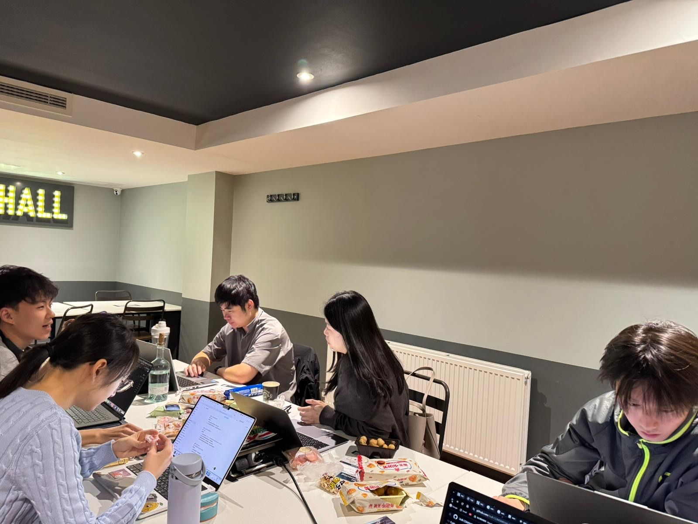 
      <strong>Figure 14 - ▲ Meeting</strong>
    

    <li>For version control, each member has a separate <b>GitHub</b> branch for development to avoid overwriting each other's code and avoid conflict.</li>
    <li>For project management, we use <a href = "https://trello.com/invite/b/698ac34dda403c044906233f/ATTI4db26394399c57af543af31092c66765564157A4/my-trello-board">Trello</a> as a Kanban Board for task organisation. Tasks are organised into "To Do," "Doing," and "Done" columns to provide the team with a visual representation of work progress and decrease the chances of duplicating tasks or tasks not being completed promptly.</li>
    

      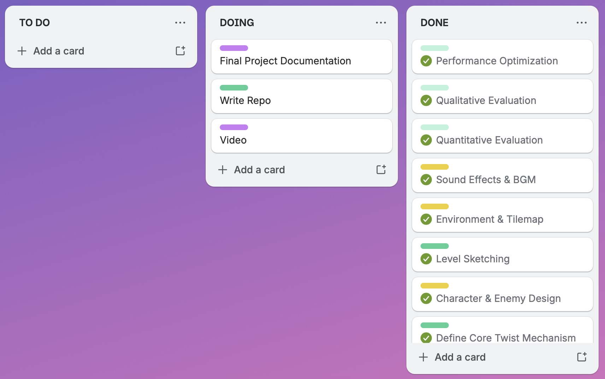 
      <strong>Figure 15 - ▲ Kanban Board</strong>
    

    <li>For communication, <b>WhatsApp</b> is our main tool. We use it for real-time discussions and to record key points from meetings. </li>
    <li>For development, we use <b>Visual Studio Code</b> with the <b>Live Server</b> extension. This allows us to test changes before committing them to GitHub, helping keep the development process efficient and consistent.</li>
</ul>

### 2. Team Roles

To provide both technical detail and efficient management of the project, our team has chosen to use the modular architecture for the system. Each member serves in two different roles: one technical role responsible for coding and building a subsystem and one administrative role responsible for the management of the project.

<table align="center">
  <tr>
    <th>Member</th>
    <th>Administrative Role</th>
    <th>Development Role</th>
    <th>Responsibilities</th>
  </tr>
  <tr>
    <td>Ming Wei</td>
    <td>Project Manager / Frontend Engineer</td>
    <td>Entity Hierarchy & Physics System</td>
    <td><b>Architecture & Physics Engine:</b> Designed the overall game architecture and object inheritance structure; implemented core collision detection and integrated audio resources.</td>
  </tr>
  <tr>
    <td>Jay-Sin Chiu</td>
    <td>Project Manager / Frontend Engineer</td>
    <td>Game Flow & Scene Manager / Enemy & Entity</td>
    <td><b>Progress Management & Gameflow:</b> Managed the development timeline and task allocation; handled UI logic, scene management, and front-end display.</td>
  </tr>
  <tr>
    <td>Yi-Hsin Peng</td>
    <td>Game Systems Architect</td>
    <td>Tilemap & Level Loader</td>
    <td><b>Map System & Camera Logic:</b> Designed level data for each stage; developed a level loader and implemented dynamic camera follow functionality.</td>
  </tr>
  <tr>
    <td>Hsun-Han Huang</td>
    <td>Game Systems Architect</td>
    <td>Character Controller & FSM</td>
    <td><b>Character Control & Game Logic:</b> Maintained system logic consistency; used a finite state machine (FSM) to implement player movement, attack detection, and control logic.</td>
  </tr>
  <tr>
    <td>Yu-Cheng Cheng</td>
    <td>Game Systems Architect</td>
    <td>Enemy & Entity / Game Flow & Scene Manager</td>
    <td><b>Game & Enemy Design:</b> Planned the game flow and progression; designed enemy behaviours such as patrolling, attacking, and object management.</td>
  </tr>
  <tr>
    <td>Ming-Yen Tsai</td>
    <td>QA & Optimization Engineer</td>
    <td>Character Controller & FSM</td>
    <td><b>Quality Assurance & Player Mechanics:</b> Implemented player grappling mechanics and attacks; handled bug fixing, testing, and performance optimisation.</td>
  </tr>
</table>

### 3. Reflection: What Worked and What Didn't

**What Worked:**
- The clear division of roles allowed each member to focus on their own subsystem without interfering with others' work.
- The use of separate GitHub branches proved reliable for avoiding code overwrites and maintaining a stable main branch.
- The pull request workflow allowed team members to review each other's code before merging, helping maintain code quality.
- When technical issues arose, team members were able to support each other promptly through WhatsApp.

**What Didn't Work:**
- Initially, inconsistencies in how team members interpreted technical requirements led to repeated modifications in certain areas.
- Establishing the game architecture in the early stages took longer than planned due to a lack of initial consensus, creating pressure during the integration phase.
- The map system required more iterations than expected, as designing each level to incorporate the three core mechanics of running, jumping, and grappling proved more time-consuming than anticipated.
- There were instances where a team member modified a shared function without notifying others, causing unexpected integration errors.
- When team members held differing opinions, reaching a conclusion sometimes took longer than necessary, occasionally slowing down the overall pace.

### 4. Adaptation

To address communication issues, the team established a clear protocol of announcing any changes to shared functions in the WhatsApp group, ensuring all members stayed informed and could adapt their code accordingly. When workloads became uneven, tasks were redistributed among members to maintain a balanced pace. To improve decision-making efficiency, we adopted a time-limited discussion approach, proceeding with the majority's opinion once a reasonable discussion period had passed. For example, during the map design process, differing opinions on difficulty level led to prolonged discussions. We ultimately held a focused meeting during the Easter break to align on a shared standard: a map is considered successful as long as players can complete it while experiencing all three core mechanics. This experience highlighted the importance of establishing clear evaluation criteria early in the design phase to avoid repeated revisions.

## Sustainability, ethics and accessibility
### 1. Environmental Dimension

Compared to the mainstream 3D titles that relentlessly pursue hyper-realistic graphics, our game, SKAARL, adopts a retro 2D pixel art style. This choice is built upon a lightweight core computational logic. This deliberate architectural decision significantly reduces CPU load and device power consumption during gameplay, effectively lowering the overall hardware threshold. By doing so, we extend the operational lifespan of our players' devices, translating our environmental sustainability goals into concrete actions that actively reduce electronic waste and unnecessary energy consumption.

Beyond these technical efficiencies, SKAARL seamlessly weaves ecological conservation awareness directly into its narrative and world-building. Players experience the entire game through the unique perspective of the protagonist, 'Mother Lizard,' allowing them to deeply empathize with the harsh survival struggles that native species endure when confronted with external environmental threats. Furthermore, the design of the enemy characters is directly inspired by pressing, real-world ecological threats. For instance, players will face off against foes resembling invasive red imported fire ants and hornets that aggressively endanger local people, ultimately culminating in a final boss battle against a wild rabbit—a notorious destroyer of agricultural crops.

Through these carefully crafted narrative metaphors and the engaging adventure, we hope that players will not only enjoy a highly entertaining experience but also subtly learn the critical importance of environmental protection and native biodiversity conservation.

## Conclusion

  This game development project was a highly rewarding practical experience. By following the weekly course content, we carried out development based on the corresponding knowledge, ensuring clear and steady project progress and enabling team members to complete tasks under well-defined goals.

  We adopted an <strong>Agile development</strong> approach, using a <strong>Kanban board</strong> to track task status. Weekly meetings were held for members to present progress and align work granularity, based on which tasks were planned. This allowed continuous monitoring of progress and timely adjustment of design directions.

  By writing <strong>user stories</strong> to derive <strong>use cases</strong> and producing <strong>Class Diagram</strong> and <strong>Sequence Diagram</strong>, we clearly defined object properties, functionalities, and interactions. This supported <strong>object-oriented programming</strong> and facilitated task allocation across different modules (e.g., physics engine, player and enemy, items, maps, and UI), improving coordination and workflow efficiency.

  We also conducted quantitative evaluation using <strong>NASA-TLX</strong> and <strong>SUS</strong>, and applied <strong>Black-Box Testing</strong>. Through frequent iterations and player feedback, we identified and resolved design issues, such as introducing attack mechanics and refining level completion conditions. A major <strong>refactor</strong> was undertaken due to excessive coupling between character states and the physics system, which caused unstable collision detection, conflicts during feature expansion, and fragmented input handling. We refactored the architecture by introducing a state machine, decoupling character data from motion resolution, implementing axis-based motion processing, and centralizing input handling, significantly improving system stability and gameplay responsiveness.

  Challenges were encountered, particularly in implementing the <strong>grapple ability</strong> and <strong>boss AI</strong>. We recognized the importance of encouraging team members to actively express their ideas during meetings, and of resolving differences through discussion, enabling more thorough and well-considered design decisions.

  In the short term, the focus is on polishing and stabilizing the core gameplay. This includes refining movement and collision to improve responsiveness and eliminate inconsistencies, as well as cleaning up the architecture to reduce coupling and improve maintainability. At the same time, more effort should go into level design, using varied terrain and obstacles to fully test and showcase the mechanics.

  For a potential sequel, this could involve introducing new abilities like glide by opening the lizard’s frill and more complex interactions to enrich gameplay, as well as more dynamic environments. On the technical side, the architecture could evolve into a more scalable system to support larger levels and more entities. Additionally, incorporating narrative elements, and player-facing features such as accessibility options or leaderboards would help transform the project into a more polished and fully developed game.

  In summary, this project resulted in the successful development of a stable, complete, and playable game. It not only enhanced our capabilities in project planning and programming, but also provided a collaborative experience closely resembling real-industry development. We learned how to effectively address challenges encountered during development and how to maximize team synergy to solve problems systematically. Moving forward, we aim to further refine this project into a more mature and polished product with the potential for market release.

## Contribution Statement

<table align="center">
  <tr>
    <th>Member</th>
    <th>Contribution</th>
  </tr>
  <tr>
    <td>Ming Wei</td>
    <td>1.0</td>
  </tr>
  <tr>
    <td>Jay-Sin Chiu</td>
    <td>1.0</td>
  </tr>
  <tr>
    <td>Yi-Hsin Peng</td>
    <td>1.0</td>
  </tr>
  <tr>
    <td>Hsun-Han Huang</td>
    <td>1.0</td>
  </tr>
  <tr>
    <td>Yu-Cheng Cheng</td>
    <td>1.0</td>
  </tr>
  <tr>
    <td>Ming-Yen Tsai</td>
    <td>1.0</td>
  </tr>
</table>

## AI Statement

